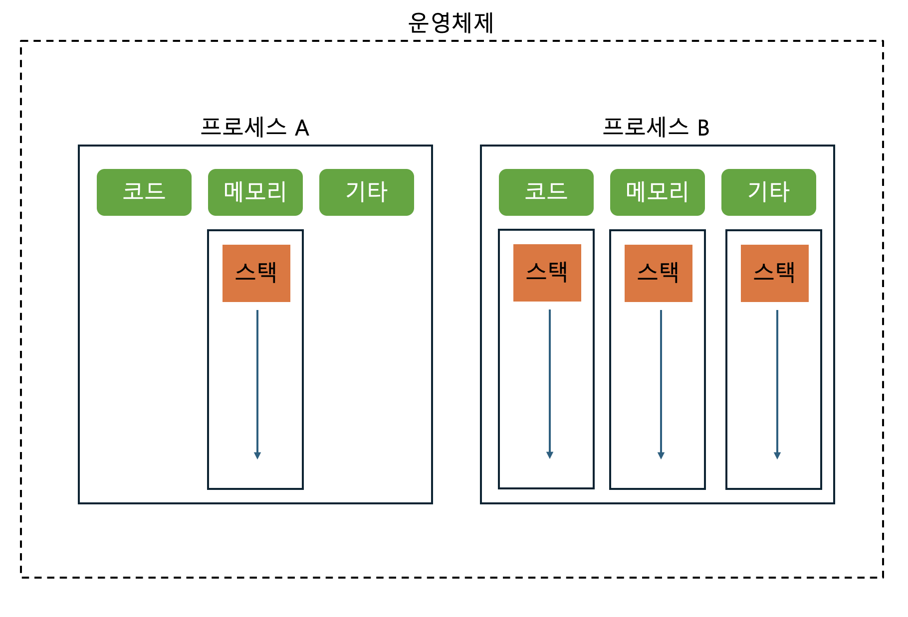

# Process

프로세스는 실행 중인 프로그램이란 뜻을 더해서 데이터 영역(전역변수)과 힙(인스턴스), 스택을 포함한다.

스레드가 스택을 포함하고 있다.

프로세스와 프로세서는 다른 뜻이다.

일반적으로,
- 프로세스 : 하나의 스레드만 가지고 있는 단일 스레드 프로세스
- 실행 단위 : CPU Core 에서 실행하는 하나의 단위(프로세스와 스레드를 포괄하는 개념)

쓰레드와 프로세스는 처리방식의 일종으로 소프트웨어 쪽과 친숙한 개념이다.

프로세스는 카카오톡, 크롬 브라우저, 인텔리제이, VSCode 등등이 될 수 있는데 카카오톡을 켜놓고 크롬을 통하여 노래도 듣고 코딩도 하고 여러가지 일을 동시에 할 수 있다.

원래 한 프로세스가 실행되려고 CPU를 점유하고 있으면, 다른 프로세스는 실행할 수 없다.

이 뜻은 카카오톡을 켜두고 친구와 대화를 하고 있으면 노래를 들을 수 없고 코딩도 못한단 뜻이 된다.

하지만, 잘 사용한다.. 왜일까?

콘텍스트 스위치라는 동시에 실행하기 위해 여러 개의 프로세스를 짧은 텀을 반복하면서 프로그램을 실행하도록 해준다.

## Context Switch

프로세스1 이 실행되기 위해 실행 중인 프로세스2는 대기 상태로 전환되고 CPU가 점유한다.

다시, 프로세스2를 실행하기 위해 실행 중인 프로세스1 은 대기상태로 전환되고 CPU가 점유한다.

이것을 반복하는 것을 콘텐스트 스위치라고 한다. 스레드에서도 해당 용어를 많이 쓴다.

예를 들어, 사람도 마찬가지로 컨텍스트 스위칭 비용이 발생한다고 보면 편하다.

A작업을 진행 중인데 급하게 B작업이 필요해져서 하다가 A로 돌아간다면 처음부터 어디까지 했었는지 확인해야한다.

이럴 때, 컨텍스트 스위칭 비용이 발생한다고 한다.

### CPU - 4개, 스레드 - 2개

스레드가 적으므로 CPU를 다 활용할 수는 없지만, 스레드가 없으므로 컨텍스트 스위칭 비용이 줄어든다.

### CPU - 4개, 스레드 - 100개

스레드가 너무 많으면 CPU를 다 활용할 수 있지만 컨텍스트 스위칭 비용이 늘어난다.

### CPU - 4개, 스레드 4개

이론적 이상적인 것으로 CPU를 제대로 활용할 수 있으며 컨텍스트 스위칭 비용도 많이 발생하지는 않는다.

### CPU 바운드 작업

CPU의 연산 능력을 많이 요구하는 작업을 의미

계산, 데이터 처리, 알고리즘 실행 등 CPU의 처리 속도가 작업 완료 시간을 결정하는 경우

### I/O 바운드 작업

디스크, 네트워크, 파일 시스템과 같은 입출력 작업을 많이 요구하는 작업을 의미

CPU가 상대적으로 대기 상태에 있는 경우가 많다.

데이터베이스 쿼리 처리, 파일 읽기/쓰기 처리, 네트워크 통신, 사용자 입력 처리 등

웹 어플리케이션에서는 주로 I/O 바운드 작업이 일어나며 사용자 하나의 요청이 한 개의 스레드가 필요하며 4개의 요청이라면 4개의 스레드가 작동한다고 본다.

# Multi Process

말그대로 프로세스가 여러 개가 존재한다

### 멀티 프로세스와 멀티 쓰레드

멀티 프로세스는 각 프로세스가 독립적이고 개별 메모리를 차지하며

멀티 쓰레드는 공유되는 메모리가 존재하고 쓰레드끼리 긴밀하게 연결되어 있다.

### 프로그램과 프로세스

프로그램 : 하드디스크와 같은 저장장치에 있는 코드가 있는 실행 가능한 파일, 수동적

프로세스 : 실행하기 위한 지침을 지정하고 자원을 할당할 수 있게 설정하는 것, 능동적

-----

동시성 : 한순간에 여러가지 일이 아니라, 짧은 전환으로 여러가지 일을 동시에 처리하는 것처럼 보이는 것