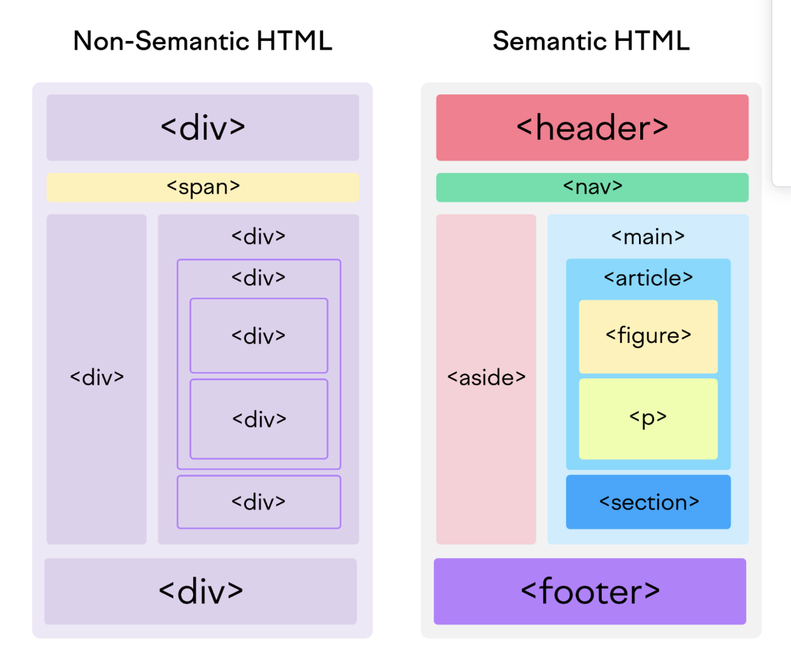

# 시맨틱과 `div`

시멘틱은 개발자와 웹 사이에 영역 기준을 명확하게 하고 있다.

`div`만 사용할 시, 해당 영역이 어떤 것을 하는지 파악하기가 어렵다는 단점이 존재한다.

시맨틱을 사용하면 애플리케이션 데이터를 공유하고 재사용할 수 있어서 권장하고 있다.

시맨틱에 해당되지 않는 것은 `div`와 `span`이 있다.

시맨틱에 해당되는 것은 `header`, `footer`, `aside`, ... 등이 있다.

```
<article>
<aside>
<details>
<figcaption>
<figure>
<footer>
<header>
<main>
<mark>
<nav>
<section>
<summary>
<time>
```

영역 구분을 일반적으로 다음과 같이 정의한다고 한다.



HTML5에서는 시멘틱을 둠으로써 더 명확한 영역과 데이터가 표현될 수 있다.

중간에 사라지는 태그들도 많고 모르는 태그들도 존재하므로 아래 mdn 링크를 참조해서 익혀두는 것도 좋은 방법인 것 같다.

-----
- [시맨틱 참고자료](https://www.w3schools.com/html/html5_semantic_elements.asp)
- [MDN Web Elements](https://developer.mozilla.org/en-US/docs/Web/HTML/Element)
- [이미지 링크](https://www.semrush.com/blog/semantic-html5-guide/)